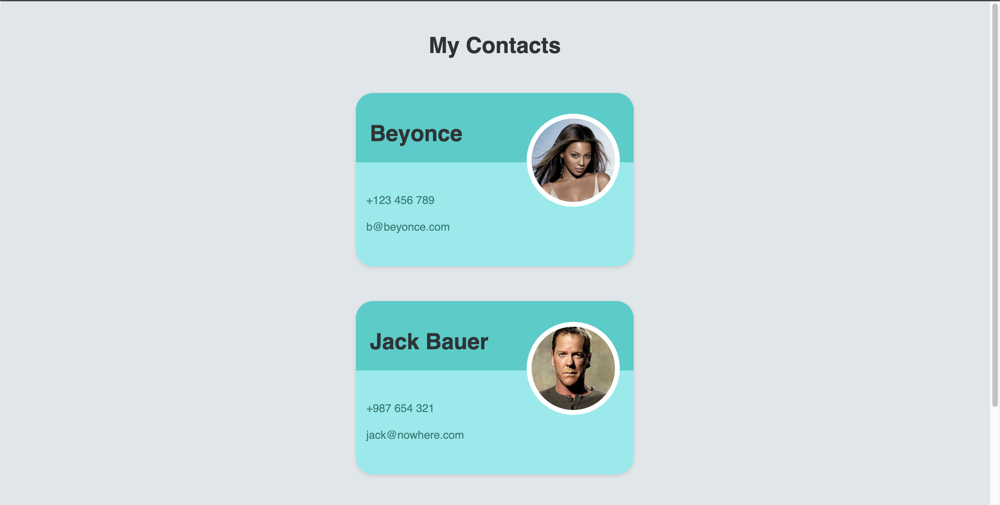

# Appbrewery - Building Contact Cards using React props

This is a practice project to learn React Props from https://appbrewery.com

## Table of contents

- [Overview](#overview)
  - [The challenge](#the-challenge)
  - [Screenshot](#screenshot)
- [My process](#my-process)
  - [Built with](#built-with)
  - [What I learned](#what-i-learned)
- [Author](#author)

## Overview

### The challenge

Users should be able to:

- Extract the contact card as a reusable Card component.
- Use props to render the default Beyonce contact card so the Card component can be reused for other contacts.
- Import the contacts.js file to create card components.

### Screenshot

## My process

### Built with

- Html
- CSS
- JavaScript
- React JS

### What I learned

Using react props to extract reusable card components

## Author

- Twitter - [@sanjayvjacob](https://www.twitter.com/sanjayvjacob)
